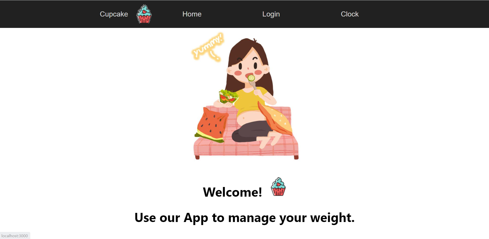
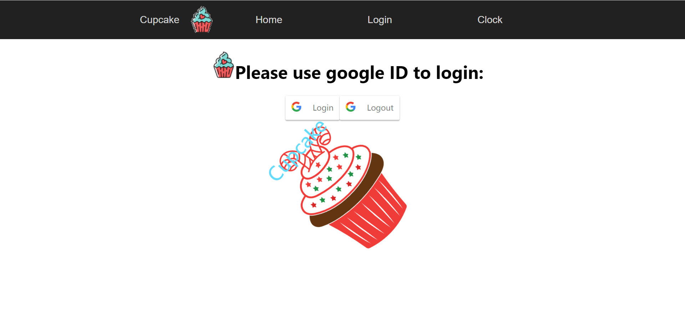

**An app aims at helping people lose weight: Cupcake   
Final Report**

Group：cupcake

Student：A0228498L-ZHENG YINJIE and A0228600N-LIU XIAOFEI

[Instructions and Google drive link](#instructions-and-google-drive-link)

[Instructions](#instructions)

[Google drive link](#google-drive-link)

[Tutorial 7 Answers](#tutorial-7-answers)

[Introduction](#introduction)

[Similar application](#similar-application)

[Difference and Novelty](#difference-and-novelty)

[Business Analysis](#business-analysis)

[Function List and Architecture](#function-list-and-architecture)

[Final function lists](#final-function-lists)

[Architecture](#architecture)

[Interim function lists](#interim-function-lists)

[Website screenshots](#website-screenshots)

[Final website screenshots](#final-website-screenshots)

[Interim website screenshots](#interim-website-screenshots)

[List of features - document](#list-of-features)

[UI Implementation](#ui-implementation)

[Back-end Implementation](#back-end-implementation)

[Summary and High-level design](#summary-and-high-level-design)

[Reference](#reference)

## Instructions and Google drive link

### Instructions

1.  Download the image in the google drive. File Name: cupcake_project.tar
2.  Use the following codes to load the image
    -   docker import cupcake_project.tar 5007cupcake:imp
    -   docker run -p 127.0.0.1:27017:27017/tcp -p 127.0.0.1:3000:3000/tcp -p 127.0.0.1:5000:5000/tcp -p 127.0.0.1:8000:8000/tcp -dit 5007cupcake:imp bash
3.  cd /home/fremp/backend
4.  screen mongod
5.  screen python3 app.py
6.  cd ../frontend
7.  screen npm start
8.  open localhost:3000 in the browser

Frontend comments : /home/fremp/frontend/src/App.js

Backend comments : /home/fremp/backend/app.py

We also uploaded test images in the Google drive link.

### Google drive link

https://drive.google.com/drive/folders/1h0NJGqKn9em3guyCHe9Qi2lDyKDjvQiU?usp=sharing

## Tutorial 7 Answers

Computer:

Cpu: Amd Ryzeen 7 4800H with Radeon Graphics

RAM: 16GB

Browser: Chrome

Belows are the average of ten measurements.

Q1.

The homepage load time: 0.34ms

Q2.

The response time of google login: 0.18ms

The response time of google logout: 0.17ms

The response time of detect calorie expend in the backend and pass the result to frontend:32ms

The response time of detect calorie intake in the backend and pass the result to frontend:depend on the input image quality:

for 512\*256 pixel:2.228s

for 2703\*3784 pixel: 6.521s

The response time of submitting expend/intake data to mongodb in the backend:26ms

The response time of showing the list of calorie expend/intake history:31ms, it’s depend on the number of records.

Q3.

The response time of uploading an image, using python program to detect calorie and submitting in the backend: 32ms

The response time of manually input calorie and submit it in the backend: 26ms

## Introduction

With the improvement of people's living standard, people's diet is getting richer and richer, but the unreasonable diet structure makes the incidence of obesity rapidly increasing in the world, and shows a trend of youth. According to the WHO official website, 39% of adults aged 18 years and over were overweight in 2016, and 13% were obese, and over 340 million children and adolescents aged 5-19 were Overweight or obese in 2016[1].

Therefore, how to lose weight is becoming a hot topic, and weight loss related products and services are becoming the next market with global potential. According to the survey statistics, the global market for weight loss products and services should grow from \$254.9 billion in 2021 to reach \$377.3 billion by 2026, at a compound annual growth rate (CAGR) of 8.2% during the forecast period of 2021-2026[2].

Many people are already planning to lose weight, and there are now many apps on the market to help people lose weight. On these apps we can make our exercise plans, we can follow the exercise videos, and we can record our daily weight. These apps have great features, but the key point is how to get people to keep exercising.

For individuals, especially for obese people, they will exercise in the first few days or weeks, but it's easy to give up and never open the app again, so the core idea of designing an app that will be accepted and appreciated by the global market is how to make users stick to it, that is, how to increase our user stickiness.

Based on the above data and facts, we plan to design an app that can help people, especially young people, to lose weight. We will use game mechanics to help people stick to eating healthy and exercising daily. What game mechanics means here is to shorten the time it takes to get positive feedback on a user's behavior. Once the user has consumed a healthy amount of calories, or burned a certain number of calories, our app will immediately give the user a virtual reward.

For example, we will consider losing 10kg as our ultimate goal. Since the cycle of healthy weight loss is long, our app will not tell you how many days you need to stick to it and how long you need to exercise every day to reach your goal, because it will easily make people feel intimidated. We will design a virtual pet to urge users to lose weight, this virtual pet has hunger value and mood value, users can feed and play with them, these two behaviors cost "Coins", and users will be rewarded with some "Coins" if they produce healthy behaviors.

Each user's virtual pet is unique, for example, the virtual pet cat, each cat's breed, color, pattern, etc. is not the same, the user can also give them a name, we designed this to increase the user's sense of belonging.

A formula to summarize the design thinking of our app is that,

**User calories expended - calorie intake = Coins which can be used to feed virtual pets.**

### Similar application

Currently similar apps can be divided into three categories.

The first category is the exercise education app, such as Keep, which has many fitness courses and detailed health plans on it. These apps mainly earn profits through advertising and selling online courses and exercise products.

The second category is GetFit, which is a healthy diet app that provides easy access to calorie information for each food and has many tutorials on how to make healthy food.

The third category is social apps. Although these apps are not mainly for the health market, there are many users posting weight loss information, their before and after weight loss transformation and some tips about weight loss, etc. Take tiktok as an example, the topic of loseweight has 1.6billion views.

### Difference and Novelty

What makes our app different from other apps is that we use game mechanics to help people stick to a healthy diet and exercise every day. This is where the novelty of our app lies.

Our app turns a potentially lengthy weight loss process into a game, where the ultimate boss is weight loss.

We set up a reward mechanism in the app, once a user does something healthy, he will immediately get a virtual reward, we call it "Coins", if the user's healthy behavior persists for a week/seven days, then he will get a big reward on the seventh day, if the user's healthy behavior persists for a month, then he will get a bigger reward on the last day of that month.

We designed a virtual pet to increase the user's sense of belonging to the app, "Coins" can be exchanged for food to feed the virtual pet, if a person is lazy and does not exercise, then his virtual pet will be hungry, sick or even die, which can urge the user to live a healthier life.

### Business Analysis

The rewards we give out in the app are divided into free virtual products and paid blind boxed products.

-   Free Rewards

    The free reward mechanism is "Coins", where the number of calories consumed by the user each day is converted into "Coins" that can be used to buy pet food by a certain percentage. At the same time, users can also unlock a variety of pet recipes or pet toys by adhering to the exercise.

-   Paid rewards

    The paid reward mechanism, for example, allows users to choose in advance what they want in the field of beauty/sports/stargazing, etc. Users do not know in advance what they will get after completing the card, so they will look forward to the reward and will be more willing to stick to the exercise.

Our app is mainly profitable in two ways, one is to pay for virtual products, for example, in the app built-in pets are cats and dogs, users can spend money to unlock other virtual pets such as pandas, tigers, squirrels, etc.. The second is a reward mechanism for users to pay, we will earn a portion of the profits.

## Function List and Architecture

### Final function lists

1.  Navigation bar
2.  Show Homepage
3.  Google Login and Logout
4.  Show clock
5.  Calorie expend
    1.  Manuallt input a number of calorie expend
    2.  Upload an image to detect calorie
    3.  Submit data to mongodb
    4.  Show the list of calorie expend history
6.  Calorie intake
    1.  Upload a food image to detect the category and calorie
    2.  Submit data to mongodb
    3.  Show the list of calorie intake history
7.  Virtual Pets
    1.  Show the pets
    2.  Feed the pets
    3.  Play with the pets

### Architecture

Figure 1. Mongodb

Figure 2. Architecture

### Interim function lists

1\. Medical information inquiry

In this module, we will briefly display and introduce the basic knowledge about the disease, such as its definition, diagnostic criteria, and symptoms of clinical manifestations.

After reading this module, users will have a basic knowledge of the disease and be able to compare it with their own symptoms.

In this module, we will use text, pictures and videos to explain the information, and we will use both English and Chinese to explain.

In this module, we will mainly implement the following functions.

1.1 Text and picture description of the disease

1.2 Audio and video description of the disease

2\. Electronic Health Profile

In this module, users are able to create their own electronic health information profile, they can enter their basic information including their age, gender, height, weight, family history of hereditary diseases, etc.

In this module, users are able to import their health profile directly from the hospital database, including their blood pressure, pulse, waist circumference, fasting glucose, etc. in addition to the basic information.

This electronic profile will be used in the next step to assess the risk of developing a disease.

In this module, we will mainly implement the following functions.

2.1 Creation of an electronic health profile and storage of data

3\. Disease Risk Assessment

In this module, users are able to get the probability of their own risk of developing the disease through deep learning/mechine learning.

In this module, we will use machine learning and other algorithms to train a deep learning model for diabetes risk assessment based on past real patient data from hospitals. We will mainly implement the following functions.

3.1 Training of a diabetes risk assessment model

3.2 Display for user risk assessment data

4\. Online disease consultation/communication

In this module, users are able to post their own questions that the doctor can answer at his or her leisure time. This part is private, but the user can also choose to make it public.

In this module, users can discuss and communicate with other users, including people who have not yet been diagnosed, patients with diseases, etc. The content in this section is public.

In this module, we will mainly implement the following functions.

4.1 User - doctor communication function

4.2 User - user bulletin board system

4.3 Doctor – doctor communication function

5\. Teleconsultation/Video Consultation

In this module, users are able to communicate with professional doctors by remote video in real time.

In this module, we will mainly realize the following functions.

5.1 Remote video call function

6\. e-Prescription

In this module, users are able to get their prescriptions electronically. It is important to note that the website does not prescribe prescription drugs. Based on authoritative medical research, the website will give the user a diet plan form and a weekly exercise program recommendation.

For those users who are at a particularly high risk of illness, the website will give advice on how to seek medical attention.

7\. Remote Rehabilitation/Treatment

In this module, users get a periodic statistical table to know if their risk of developing diseases has decreased by updating their electronic health records regularly.

8\. Health Education

In this module, the website will publish a series of lecture information, and the professional medical personnel will give medical popularization and health education to the users.

In this module, we will mainly implement the following functions.

8.1 live/conference function similar to zoom, twitch

9\. Online OCR Scanning

In this module, users can upload data by scanning patient medical record pictures without typing information one by one. When the users register, the basic information of the user can be obtained by scanning NRIC card.

## Website screenshots

### Final website screenshots

Figure 3. Homepage

Figure 4. Clock

Figure 5. Google Login

Figure 6. Calorie Expend

Figure 7. Calorie Intake

Figure 8. Virtual Pets

### Interim website screenshots

We used html+css to implement the website. We designed some of features, including the menu, homepage, healthprofile, and login interface.

Below are the details of what each html file contains.

Index.html

\-includes a navigation.

\-includes a cover photo and some texts about the website and what the users can do.

\-includes some pictures to show more features.

\-inclueds a video and the whole functions.

Figure 9. Homepage\_ navigation

Figure 10. Homepage\_ basic information

Figure 11. Homepage\_ video

Figure 12. Homepage\_ whole functions

Health-profile.html

\-includes two navigations.

\-includes a part to show the user’s basic information and health information.

Figure 11. Profile\_ basic info

Figure 12. Profile\_ health info

Figure 13. Login

## List of features

### UI Implementation

1.  In Login Page, in addition to the Google login function, we also added a rotating Cupcake as our logo on the login interface.
2.  Before Login, user is unable to visit "CalorieExpand" , "CalorieIntake" and "My Pet" Page, this is implemented by checking "this.state.username" is empty string or not when rendering. If user log in, the website will show "CalorieExpand" , "CalorieIntake" and "My Pet" Page; if user logout, "CalorieExpand" , "CalorieIntake" and "My Pet" Page will gone again.
3.  We use Router for building up a navigation bar, and this navigation bar will be different when user login and logout.
4.  User can Select image and upload that image to backend.
5.  When user key in calorie count manually in textbox in in CalorieExpend page, this.state.calorie_comsume will changed in realtime.

Figure 13. CalorieExpend page

1.  Visualize pet info(Happiness and Health) by defining a progress bar.
2.  GoogleLogin
3.  Can fetch a set of calorie records from backend, return a table(including table head) to display them
4.  All necessary input from front-end to back-end are stored in FormData format.
1.  Noted that when showing pet, different petname will render different pet image! Below are some examples.Figure 14. Different pet
2.  We also give complete instructions for new users to be familiar will all the functions
3.  When user clicking "Detect" button to detect calorie intake, frontend will show "Now detecting, please wait!"

### Back-end Implementation

Setup Automation: Scripts to automatically setup the back-end environment. By simply run command: screen python3 app.py

-   **Pet Info**
-   **When finding pet info in backend, if user do not have any pet yet, randomly generate a new pet for user.**

    Our back-end code hopes to solve such a problem: when the user does not have a pet, the back-end will automatically generate a pet to the user at random.

    In our programme,if cannot find pet information with userid in Mongodb, it will be generated randomly from 'Pikachu', 'charmander', 'bulbasaur', 'squirtle'. At the same time, the front-end will also obtain the generated pet name and load the corresponding image, which is very interesting!

-   **Health and happiness of pets decrease gradually over time — updated by calculating time difference**

    Our solution is: every time the user clicks these three buttons "Play him with toys","Feed him with food" and "Show my pet" to request data from back end, upload the current timestamp at the same time. For each front-end request, we perform the following operation (share the same code segment at the back end): obtain the timestamp of the user's last access from the database, and calculate the time difference between the two timestamps (in seconds). The health and happiness of PET were updated by calculating time difference. Finally, update the timestamp to the new one.

-   **Calorie Expend/Calorie Intake**
-   Use deeplearning model to Detect Calorie Intake image **(using tensorflow backend).**
-   By **executing another python file in backend :demo.py** to Detect Calorie Intake image.
-   Image file to will be removed after detection task finished to avoid file conflict.
-   Use 3rd party library"pytesseract" to Detect Calorie Expend image to get OCR result.
-   **However list object in python cannot send to frontend directly, so I modified the** response **list into a dict format**
-   **OCR / deeplearning algorithm**
-   OCR：Use 3rd party library"pytesseract" to Detect Calorie Expend image to get OCR result.
-   Deeplearning : Use tensorflow pretrained model to Detect Calorie Intake image.

## Summary and High-level design

In general we have implemented all the features needed for our app. Once the user opens the wesite, he can easily use google login and logout, upload his exercise pictures and record the number of calories he has consumed, and he can also view the history of his past uploads. Similarly, the user can upload a picture of the food he ate that day and the app will automatically recognize the type of food and record the calories consumed by the user. Users can also click Mypet button to view their virtual pets, feed them or play with them.

In the future we will continue to add a calendar feature within the app where users can use the calendar to see information about their past calorie intake and expend, and when they will be rewarded. We will also be expanding our pet database to include more buttons and behaviors that interact with the user now that we have the feed and play features, and we will be expanding these features in the future.

## Reference

[1] https://www.who.int/news-room/fact-sheets/detail/obesity-and-overweight

[2] https://www.prnewswire.com/news-releases/global-weight-loss-products-and-services-market-report-2021-the-business-of-weight-loss-in-the-20th-and-21st-centuries-301354957.html
